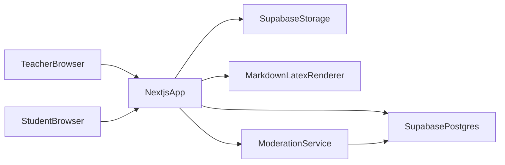

# 数学题目网页 Demo 架构方案

## 目标与边界

- 先做 **可演示 Demo**：不做登录鉴权，但保留可扩展到登录/角色的代码结构。
- 支持题目字段：标题、题干（Markdown/LaTeX）、选项/答案、解析、附件（图片/PDF）、标签/难度。
- 学生点击题目进入详情页，查看并发布评论。
- 评论采用 **多级楼中楼**。
- 预留基础治理：管理员可隐藏内容（题目/评论）。
- 维护开发过程文档：逐步记录设计与实现决策。

## 技术选型

- 前端与 BFF：Next.js（App Router）
- 数据与存储：Supabase（Postgres + Storage + RLS 预留）
- 渲染：Markdown + LaTeX（KaTeX）
- 评论树：邻接表模型（`parent_id` 自引用）+ 递归查询/分层拉取

## 推荐目录结构

- `[/home/tou/math-demo-web/app]( /home/tou/math-demo-web/app )`：页面路由（题目列表、题目详情、发布页）
- `[/home/tou/math-demo-web/components]( /home/tou/math-demo-web/components )`：题目渲染、评论树、上传组件
- `[/home/tou/math-demo-web/lib/supabase]( /home/tou/math-demo-web/lib/supabase )`：Supabase 客户端与数据访问层
- `[/home/tou/math-demo-web/lib/domain]( /home/tou/math-demo-web/lib/domain )`：领域类型与未来 auth/role 抽象接口
- `[/home/tou/math-demo-web/supabase/migrations]( /home/tou/math-demo-web/supabase/migrations )`：表结构与索引
- `[/home/tou/math-demo-web/docs/DEV_LOG.md]( /home/tou/math-demo-web/docs/DEV_LOG.md )`：逐步开发记录（你要求的维护文档）

## 核心数据模型（首版）

- `problems`
  - `id`, `title`, `stem_md`, `options_json`, `answer_md`, `analysis_md`, `tags[]`, `difficulty`, `status`, `is_hidden`, `created_by_alias`, `created_at`
- `problem_assets`
  - `id`, `problem_id`, `file_url`, `file_type(image|pdf)`, `sort_order`
- `comments`
  - `id`, `problem_id`, `parent_id`, `author_role(teacher|student)`, `author_alias`, `content_md`, `is_hidden`, `hidden_reason`, `created_at`
- `moderation_events`
  - `id`, `target_type(problem|comment)`, `target_id`, `action(hide|unhide)`, `operator_alias`, `created_at`

说明：即使无登录，也先保留 `author_role` 和 `operator_alias` 字段；后续接入登录时可平滑替换为 `author_user_id`。

## 页面与交互流程

- 题目列表页：展示题目卡片（标题、标签、难度、摘要）
- 题目详情页：渲染题干/选项/答案/解析 + 附件预览 + 评论区入口
- 评论区：支持任意层回复（UI 采用缩进树 + 折叠）
- 题目发布页（老师视角 Demo）：填写字段并上传图片/PDF
- 管理入口（临时 admin token）：隐藏/恢复题目或评论

## 架构图（可扩展到登录）

## 可扩展设计（为后续登录做准备）

- 在 `lib/domain` 定义 `IdentityContext`：当前先由前端表单传 `role+alias`，后续可切换为 Supabase Auth session。
- 数据访问层统一走 repository（而非页面直接调 SDK），后续替换权限逻辑时改动最小。
- 在数据库提前保留 `author_user_id` 可空字段与相关索引。
- 管理操作统一走 server actions / route handlers，避免未来权限散落在前端。

## 分阶段实施

1. 初始化 Next.js + Supabase 项目骨架，建立 `DEV_LOG.md` 记录模板。
2. 完成数据表迁移与 Storage bucket（图片/PDF）。
3. 实现题目发布与列表/详情渲染（Markdown+LaTeX+附件）。
4. 实现多级评论发布与树形展示（分页按题目分片）。
5. 实现管理员隐藏能力（题目/评论）。
6. 补充扩展点：auth 接口占位、角色映射、关键测试与 README。

## 验收标准（Demo）

- 可创建题目并上传附件；列表可见，详情渲染正确。
- 题目下可发表多级评论并实时/准实时展示。
- 可执行管理员隐藏并在前台生效。
- `DEV_LOG.md` 完整记录每一步开发与后续扩展建议。

## 部署决策更新（2026-03-31）

- 目标是让中国国内用户在不使用 VPN 的情况下可访问，因此部署使用阿里云托管的 Supbase 产品，采用托管能力组合（如 RDS + OSS + 托管 Web/函数）

